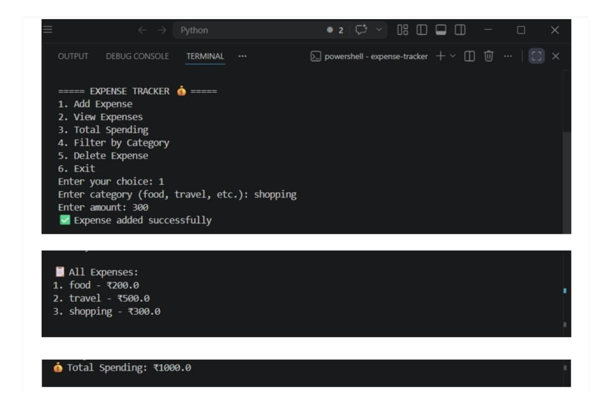
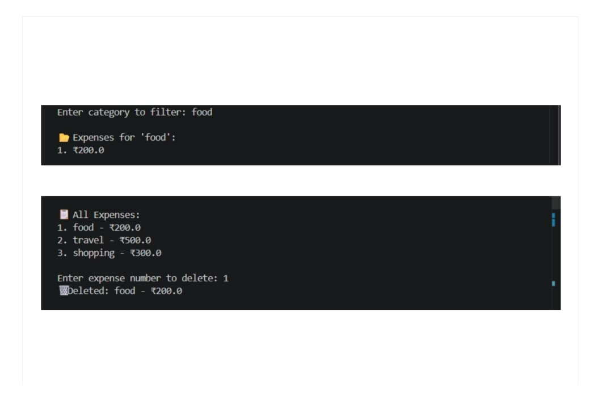

# Expense Tracker 💰

A simple yet powerful Python-based command-line application to track and analyze daily expenses using JSON storage and modular design.

---

## 🚀 Features

- Add new expenses
- View all expenses
- Calculate total spending
- Filter expenses by category
- Delete an expense

---

## 🧠 Concepts Used

- Python (Functions, Loops, Conditionals)
- Lists & Dictionaries
- File Handling (JSON)
- Modular Programming

---

## 📂 Project Structure

```
expense-tracker/
│
├── main.py      # User interface (menu & input handling)
├── tracker.py   # Core logic (add, delete, filter, etc.)
├── data.json    # Data storage
├── assets/      # Screenshots (output images)
└── README.md
```

---

## ▶️ How to Run

```bash
python main.py
```

---

## 📸 Sample Output

### ➤ Adding & Viewing Expenses


### ➤ Filtering & Deleting Expenses



---

## 💡 Future Improvements (V2)

- Use Pandas for data handling
- Monthly and category-wise analytics
- Data visualization (charts)
- Export reports

---

## 👨‍💻 Author

Shridhar Tapakire
